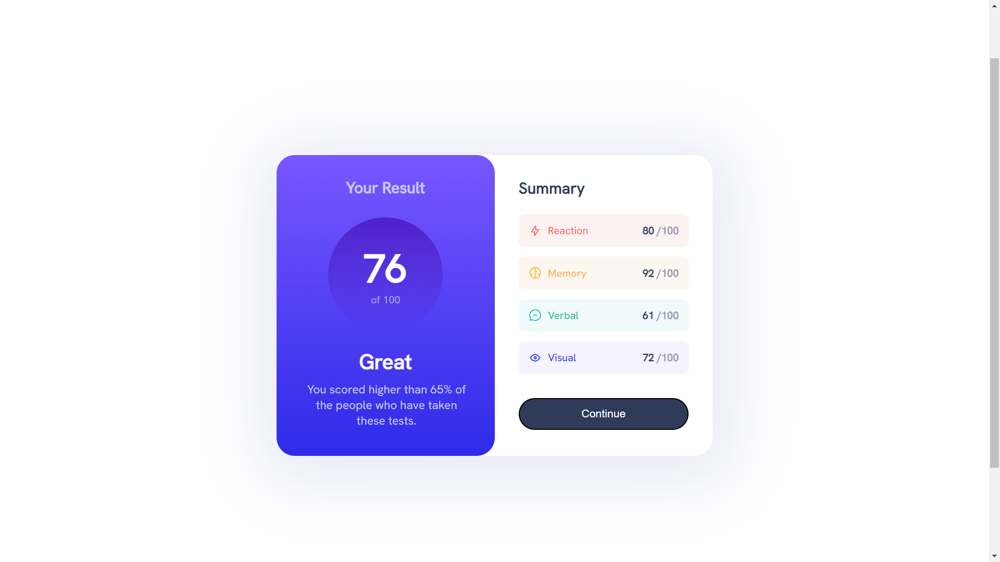

# RESULTS-SUMMARY-COMPONENT

SECOND CHALLENGE OF FRONTENDMENTOR.IO.

This is my second solution to the [QR code component challenge on Frontend Mentor]. 

### Screenshot

### Built with

- Semantic HTML5 markup
- CSS custom properties
- Flexbox
